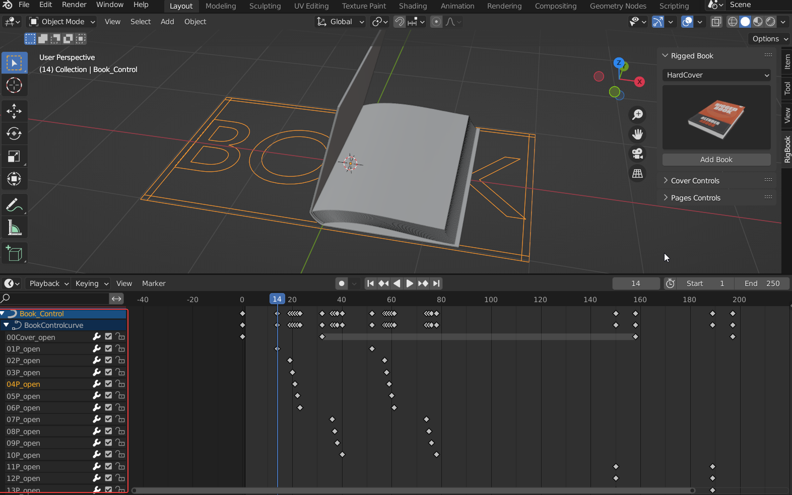
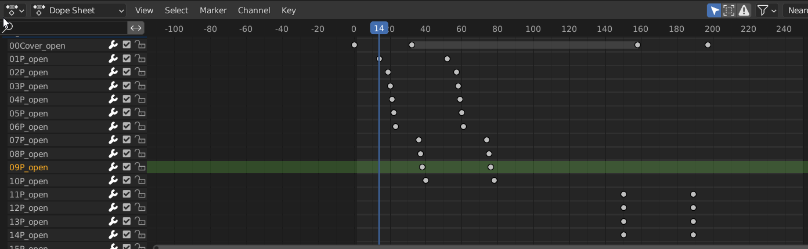

# 动画调节

**创建书页后，播放，会看到预先设置好的动画。**

选中控制器，即可在时间线面板看到封面和每一页的动画关键帧。

封面，内页每一页，都有单独控制其翻开动画的关键帧。每一页都有两个关键帧，分别控制书页从静止到翻开180°的形态。比如00Cover_open控制的是封面的翻开动画。01P_open控制的是第一页的翻开动画，以此类推。您要做的只是根据需要，调节关键帧的位置即可。

这里建议在时间线面板按shift+F12切换到DopeSheet界面，因为在这个面板下，当您选中左边的属性名称时，后面对应的关键帧会高亮显示，您不会在很多的关键帧里看花了眼。

!!!注意书页关键帧的顺序
	注意，一定要注意书页的关键帧的顺序，让后一页的起始帧在前一页的起始帧的后面，结束帧在前一页的结束帧的后面，比如，不要让第二页的比第一页的先开始翻动，不然会出现书页的穿插问题。

!!!如果不小心删除了关键帧怎么找回来
	选择控制器，在控制器的自定义属性里，有所有参数，找到需要的参数给它打关键帧即可。
	
	

!!!如何制作书页合上的动画
	如果要制作书页打开后又合上的动画，可以把后面的关键帧都删掉，把前面的关键帧mirror一下。
	