# 手动替换材质贴图

**改变书的封面：你需要首先准备三张jpg图片**：  
类似下面这样，分别对应书封面的正面、底面和侧面：

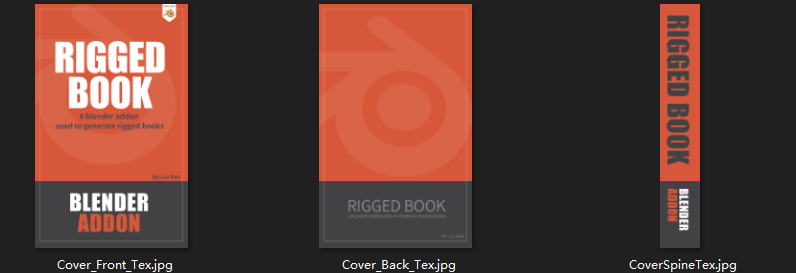	

**封面材质：**选择封面模型，它有四个材质，主要控制封面的不同区域的贴图
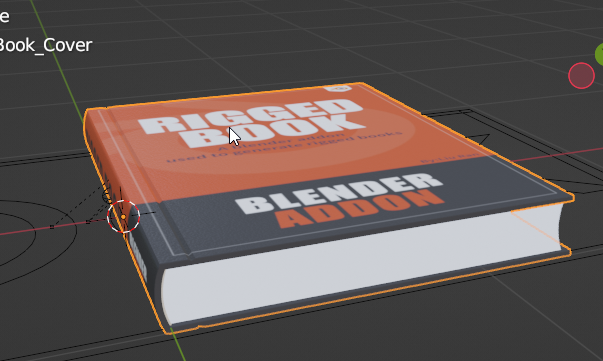	
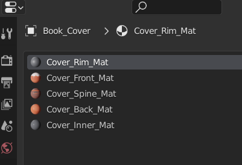

**Cover_Front_Mat：**控制封面上面贴图的材质
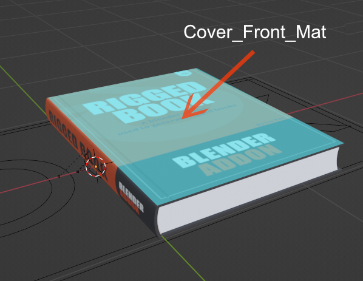

**Cover_Spine_Mat：**封面侧面的贴图 
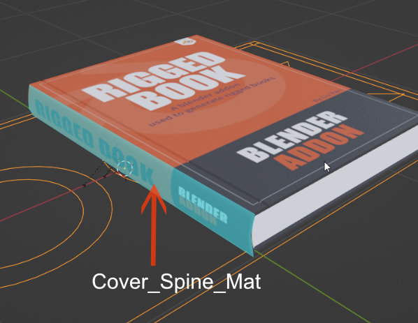

 **Cover_Back_Mat：**封面地面的贴图 
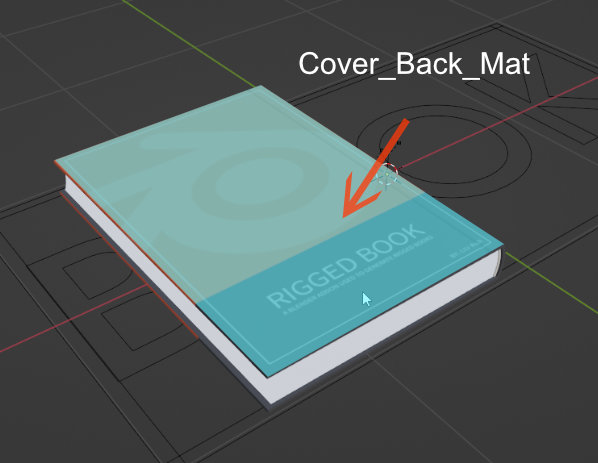

 **Cover_Inner_Mat：**封面内部的颜色或贴图
 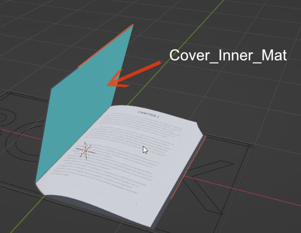

 **Cover_Rim_Mat：**封面内部的颜色或贴图
 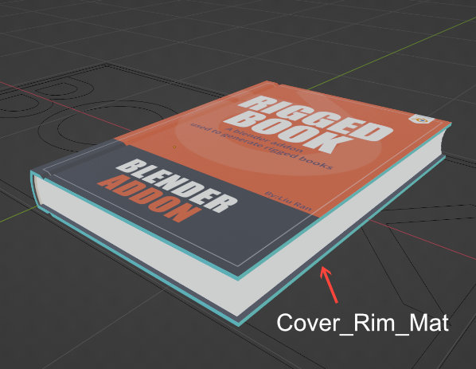

**改变书内页材质**：每一页，都有一个单独的简单材质，您选中书页，在材质管理器里，就会发现这个材质。

**改变书页bump贴图**：每一页的bump贴图通道都有一个bump_node节点组，选中任一书页，选中它节点图里的bump_node节点组，按tab键，进入节点组，修改节点组里的tile_paper贴图即可。由于节点组是每个书页材质公用的，所以修改一个，所有的都被修改。同时节点组里制作了uv随机偏移的节点，不用担心书页凹凸材质重复。
 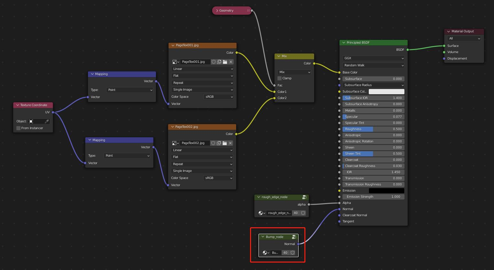
 
 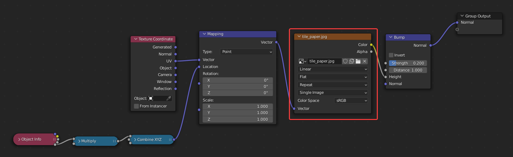

!!! Note
	因为纸张有正反面，所以每个材质都有两张贴图，分别对应该页的正面贴图和反面贴图。把这些贴图改成您自己的贴图即可。
	 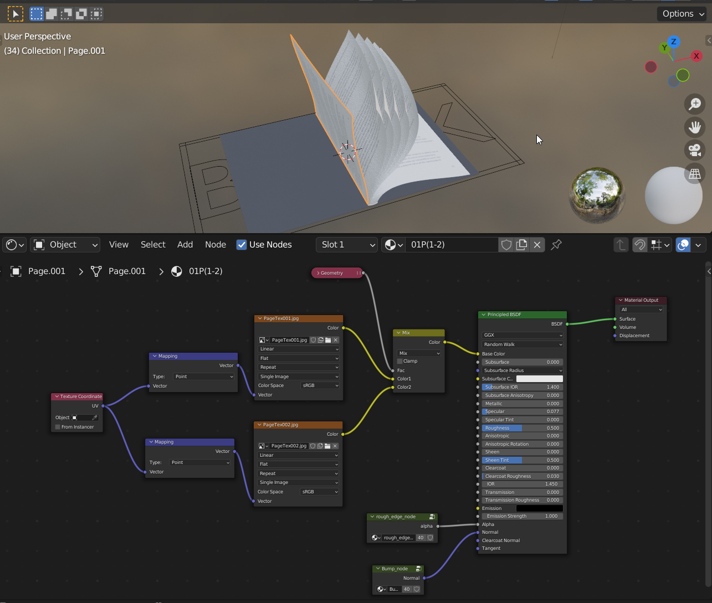

