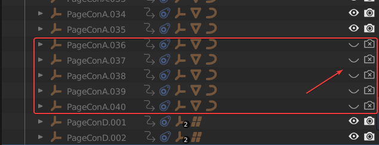
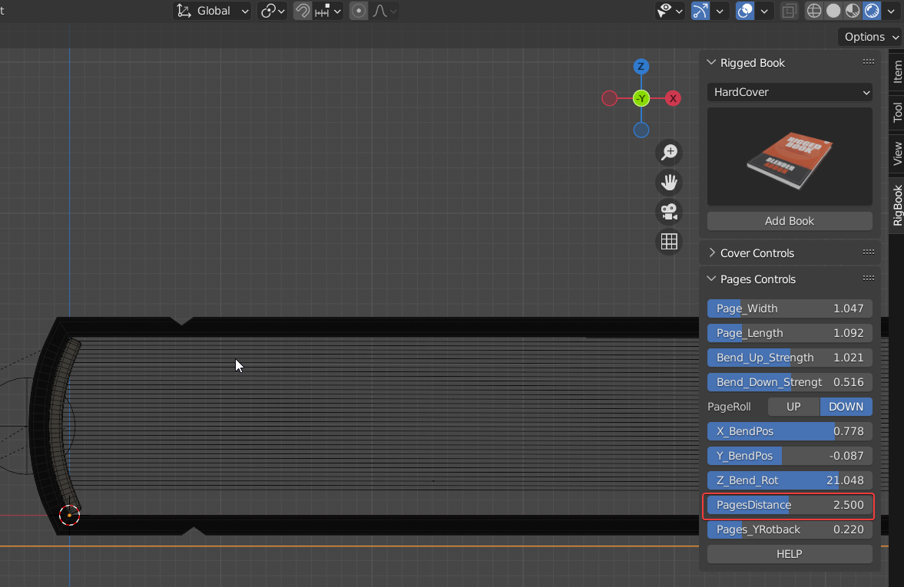

# 页数定制

**首先明确，本插件最多的页数是100页，也就是有100张纸（页码1-200）的书。**

根据我自己的实际需求，大部分时间是不需要非常精确的页数的书本。只需要大概的厚度即可。

但是如果你真的需要，可以按以下的方法来做。

首先选择一个比你需要的页数大，但又最接近的页数的预设，比如您需要的是35页，您就选择40页的预设。

在HC(40P)这个集合里面，找到PageConA.036到PageConA.040这5个空物体，按住shift键，把他们右边的Hide in ViewPort和Disable in Renders关闭。

然后选择书本的控制器，调节Pages Controls下面的PagesDistance，让书本的页数适应书本的高度即可。

