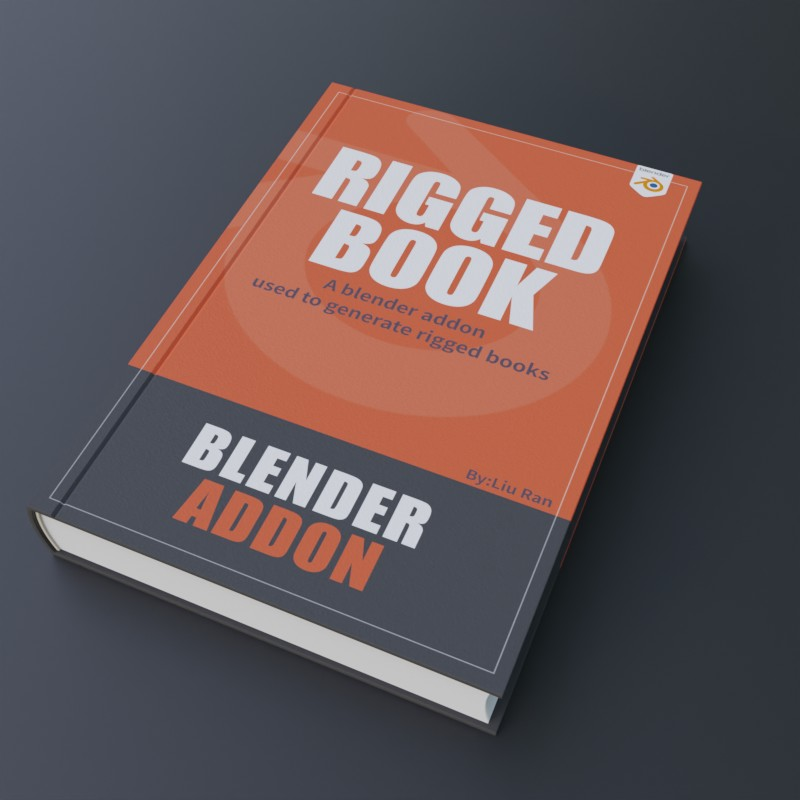

# 概述
{: width="400" }

**RiggedBooks是一个在Blender里快速创建可以翻页的书本的插件。**

**特点：**

-   **两种封面类型**：硬皮和软皮。  
 

-   **书页没有穿插**：不会出现书页翻动时的穿插问题。  
 

- **每种类型都包含多个页数的预置（P代表页数）：**10P，20P，30P，40P，50P，60P，80P，100P。   
   

- **可以自定义的参数：**书本的高度，宽度，长度，封面厚度，书脊弯曲的弧度，书绑带的厚度长度。  
   
  
- **可以调节书页随机变化，实现书页参差不齐的效果。**  
     
  
- **可以自定义书页翻开和落下时的弯曲程度，发生弯曲的位置。**  
     

- **可以调节书页打开后，左右两边形成拱形的书页的松散程度。**  
     

- **所有书封面材质都是可以自定义的:**书本每一页内容都是可以自定义的。  
   
  
- **一键实现毛边效果:**可以用来制作有破损的书页，并且提供了很多参数，可以调节毛边强度，宽度，粗糙度，细节。  
   

- **每一张书页翻开的动画关键帧都是独立调节的，**自定义翻页动画时间很方便且直观。  
     
- **可以一键将书页的翻开状态转换成静态模型。**    
  
 
- **一键批量替换贴图的功能。**    
  

- **包含自定义所需页数的教程。**  
   
  
!!!note
		本插件最多100张纸，页码最多到200页