# 插件功能概述
{: width="400" }

**Riggedbooks是一个在blender里快速创建书本翻页动画的插件。**

**功能：**

-   **可创建两种封面类型的书: **：硬皮书和软皮书。 
 
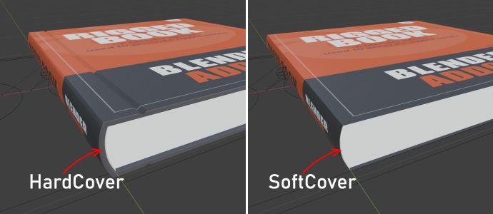
-   **书页没有穿插**：在翻页时页与页之间没有穿插的问题。
 
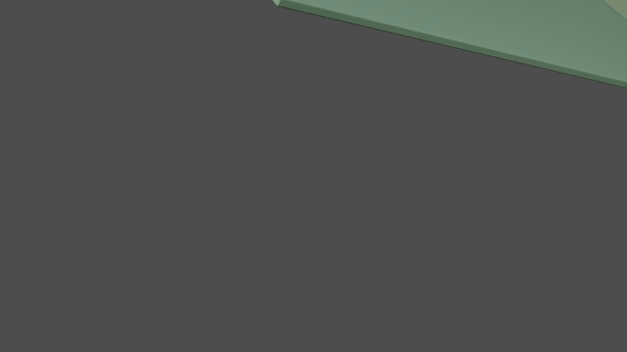 
- **每一种都有多个页数的预置：（P代表页数）**10P，20P，30P，40P，50P，60P，80P，100P，页数不同，厚度也不同。      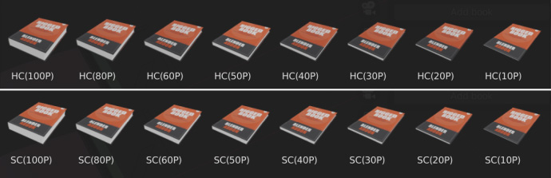
- **可自定义的参数：**
 
       封面的长，宽，高。
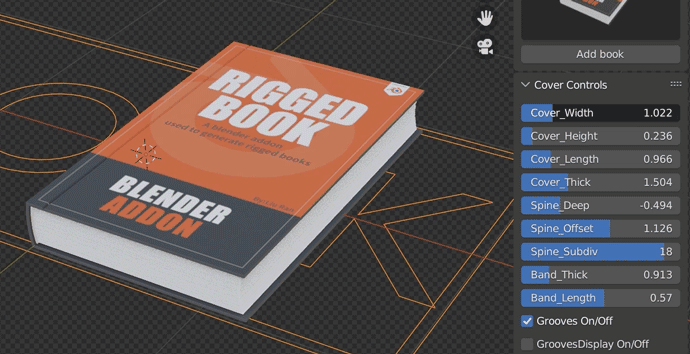 

    封面的厚度和书脊的弯曲弧度。
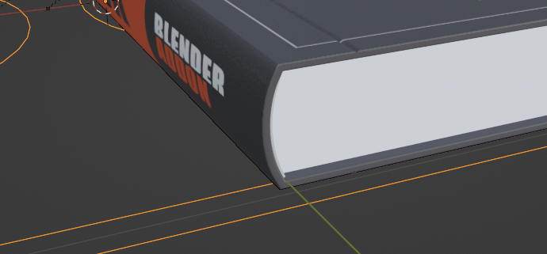 

     可调节书页翻动的弯曲效果。
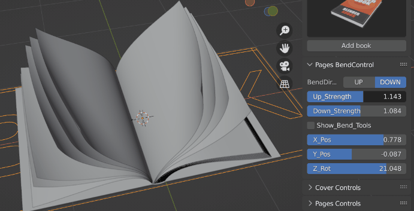 
   
  
- **可实现书页参差不齐的效果：** 调节书页控制里书页的随机强度可以实现书页参差不齐的效果。
 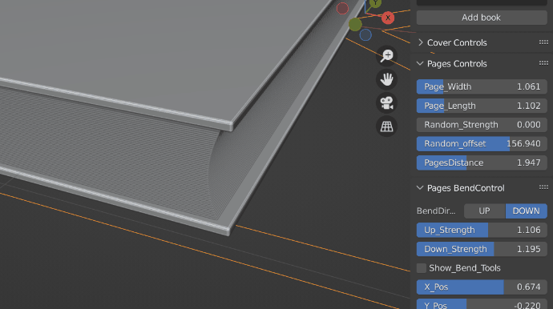  
     
- **书页拱形控制:** 能够调节在书本打开状态下两边书页的松散状态。
 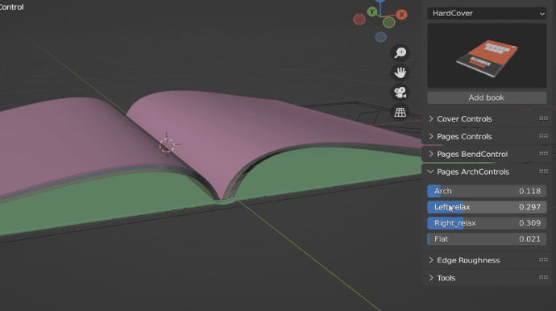  
     

- **所有材质都可以自定义：:**材质系统简单，直观。
   
  **封面材质:**  
  针对封面的正面，侧面，背面，内面和厚度部分都有对应的材质球来控制。
  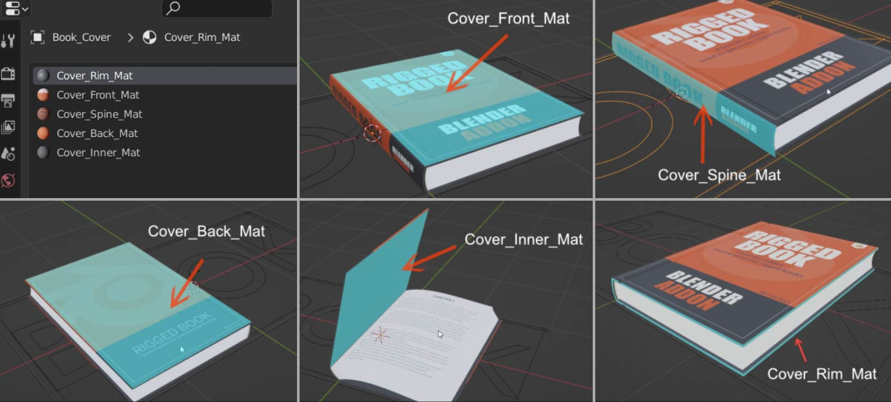  
  **书页材质:**  
  每一张书页都有它自己的材质，都有两个图片节点，分别控制该书页的正反面贴图。
  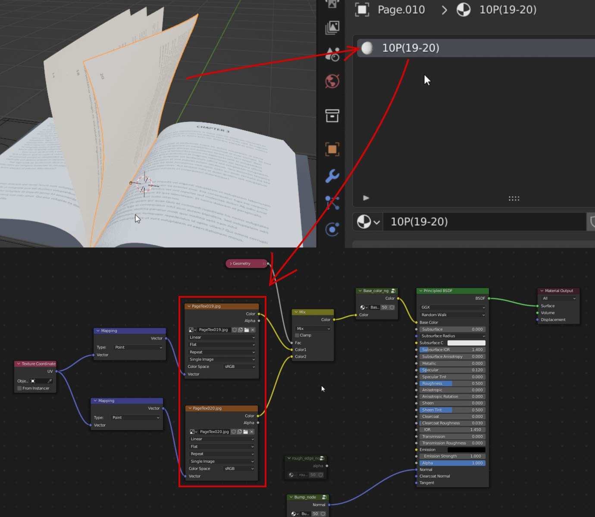    
   
  - **一键批量替换所有贴图:** 准备好你的贴图，并且按照既定的规则命名，就可以一键批量替换所有贴图。
   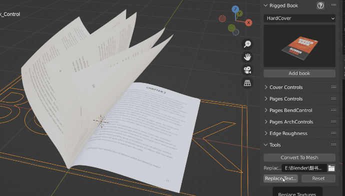  
  
- **一键实现书页毛边破损效果:**  
插件可以实现书页破损的效果，提供了一系列的参数控制毛边的强度，宽度，粗糙度和细节。
 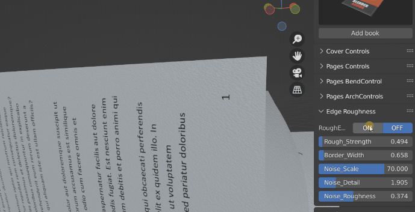  
   
- **书页的封面和内页都有单独的关键帧控制翻页动画：**  
可以很方便直观得调节书页的翻开动画。
 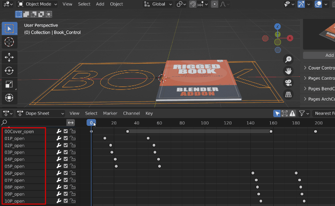  
     
- **可以一键将书本动画转换成静态模型：**    
 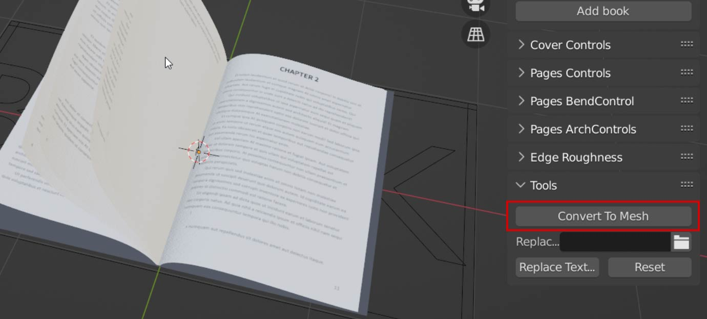    
  

 
