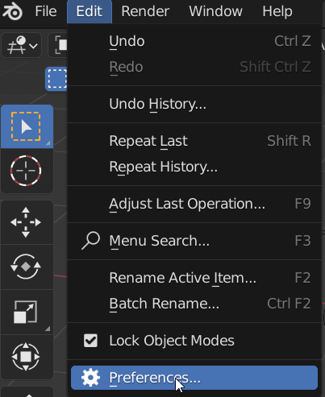
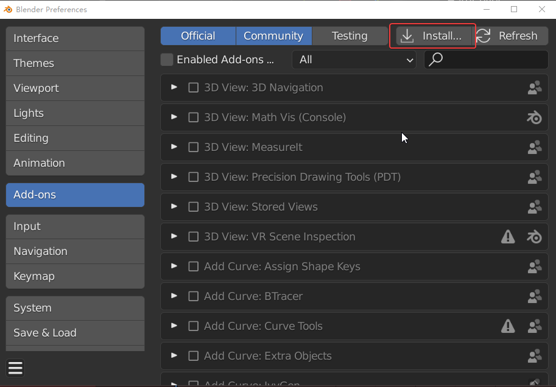
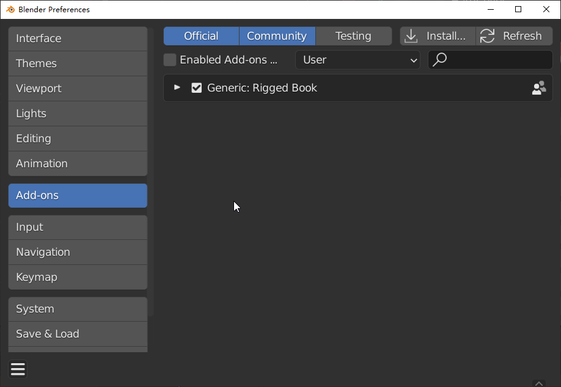
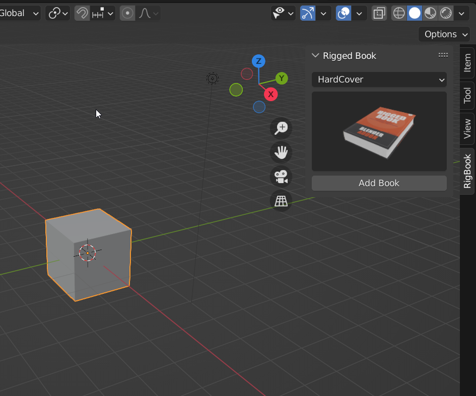

# 安装

和所有Blender的addon的安装方式一样。  
打开Edit>>Preferences面板

在Add-ons栏，点击Install，然后选择插件压缩包，安装

勾选Rigged Book即可启用插件。

插件会显示在N-panel面板。

!!!note
	当然，您也可以直接把解压缩的文件夹拷贝到blender的addon文件夹里，再启用也是可以的。
	C:\Users\“**yourname**”\AppData\Roaming\Blender Foundation\Blender\3.0\scripts\addons

**卸载**  

1.在插件面板，禁用插件。Disable the add-on and save the user preferences.  

2.点击移除按钮。click the  remove button。