# 参数解释

##CoverControls Panel：

 **Cover_Width：**封面的宽度

**Cover_Height：**书本的高度

**Cover_Length：**书本的长度
 
**Cover_Thick：**封面的厚度

**Spine_Deep：**书脊突出或凹陷的深度  
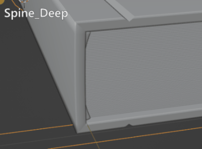	

 **Spine_offset：**书脊分段的偏移值(注意，如果发现翻页过程中封面出现了破面穿插，可以调节它和Spine_subdiv的值)  
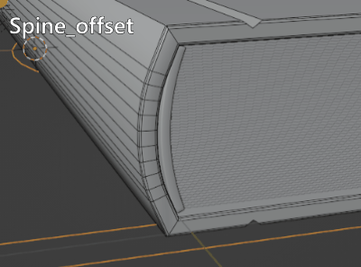
	
**Spine_subdiv：**书脊分段数量  
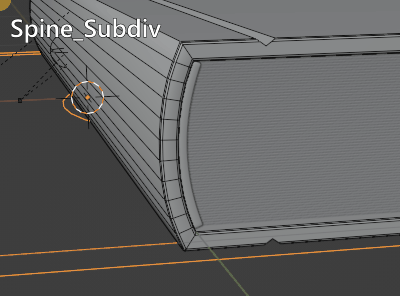
	
**Band_Thick：**书绑带的厚度  
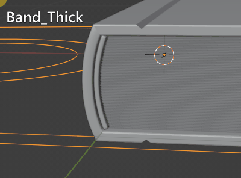

**Band_length：**书绑带长度

**Grooves On/Off：**打开或关闭书封面凹槽

**GroovesDisplay On/Off：**书封面凹槽模型是否显示,书面凹槽是一个立方体和封面进行布尔运算制作的，通过这个开关把凹槽模型显示出来后，就可以在侧视图通过编辑模式调节模型的形态，从而自定义凹槽的形态。

**Nulls_Display：**其他控制器，基本用不到

---

##PageControls Panel

**Page_Width:**书页的宽度

**Page_Length：**书页的长度

**Random_strength:**控制书页产生参差不齐效果的强度。
  
 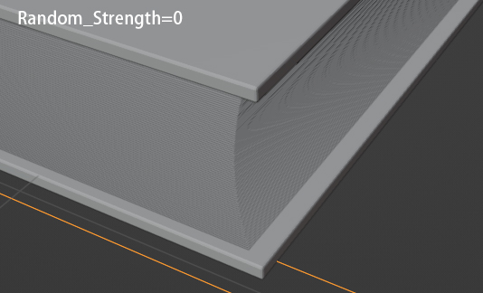{width=49%} 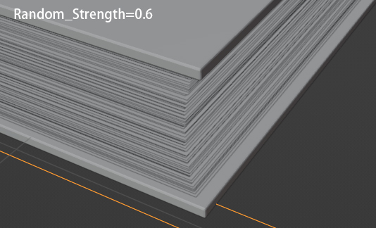{width=49%}

**Random_offset:**调整参差不齐效果的变化。

**PagesDistance:**每页之间的距离

---
##Pages BendControl Panel
 **BendDirection:** up或down，控制书页的弯曲发生在书页的上半部分还是下半部分
 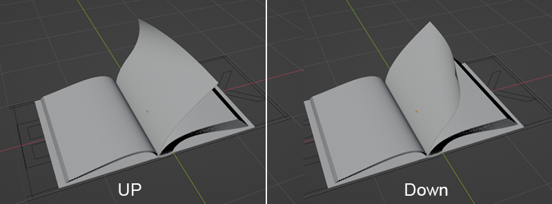
 
 **Bend_Up_Strength：**所有书页在翻起时弯曲的强度  
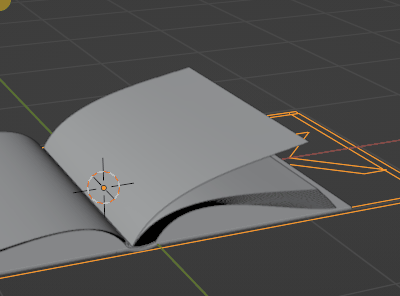

**Bend_Down_strength**：所有书页在落下前弯曲的强度
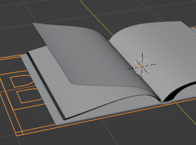

 **Show_Bend_Tools：**是否显示跟书页弯曲相关的控制器 
 
以下三个参数调整时最好打开**Show_Bend_Tools**：

 **X_Pos:**调节书页弯曲效果器的位置X
 
 **Y_Pos:**调节书页弯曲效果器的位置Y
 
**Z_Rot:**调节书页弯曲效果器的旋转Z

---

##Pages ArchControls Panel
**Arch:**书页翻开后书页中部往下压的程度。
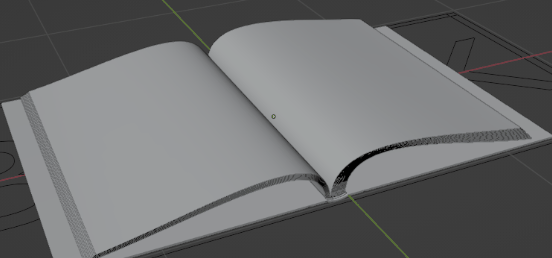

**Left_relax:**书页翻开后书页左边松散程度。  
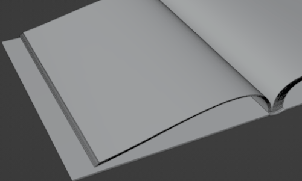

**Right_relax:**书页翻开后书页右边松散程度。 由于绑定的关系，所以调整右边的松散度时，左边也会受到影响，这两个参数酌情配合使用。 
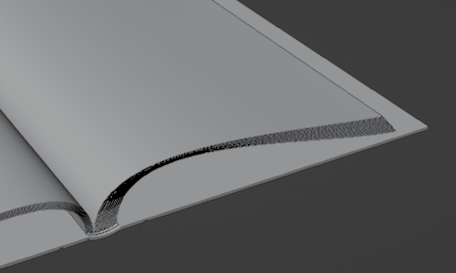

**Flat:**书页翻开后书页中部往下压的程度，和arch参数很像，但原理不同，可以配合使用。

---

##Edge Roughness Panel
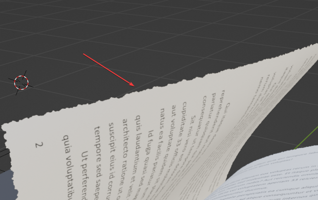{width=100%}

**RoughEdge:ON/OFF**,书页边缘破损开关。每个书页的材质alpha接口上都连了一个节点组rough_edge_node来控制书页的破损效果，这个开关就是统一控制所有书页材质里的这个节点组的开关。打开就有破损效果，关闭则无。如果您把这个节点组删除，那么插件面板里关于边缘破损的效果将不起作用 。
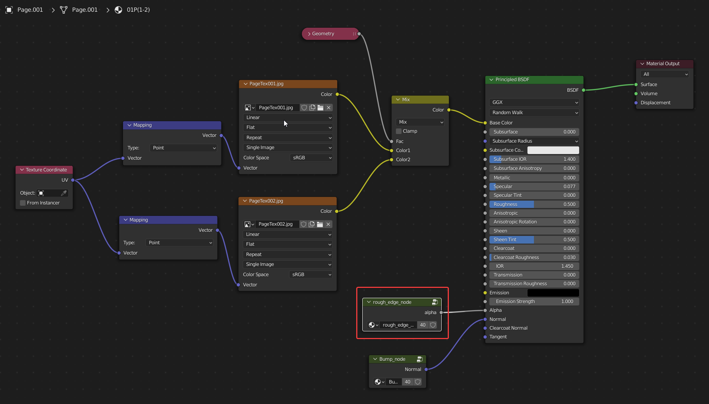

**Rough_Strength:**，边缘破损强度。

**Border_Width:**边缘破损深度，即受影响的书页范围。

**Noise_Scale:**边缘破损是基于噪波贴图的，这个是控制噪波的尺寸，可以控制毛边的大小。

**Noise_Detail:**噪波的细节。

**Noise_Roughness:**噪波的粗糙度。

---
##Tools
**Convert To Mesh:**将书本当前的形态转换成没有动画的静态模型。

**Replace tex:**需要替换贴图所在的路径。  

**Replace Texture:**替换按钮。
!!!使用方法  
	将您封面贴图按照**Cover_Front_Tex，Cover_Spine_Tex,Cover_Back_tex**命名，  
	将替换书页按照**PageTex001，PageTex002，PageTex003，...,PageTex200**命名，  
	确保贴图都放在替换路径下面，然后点击替换按钮，即可批量替换。

**Reset:**重置贴图。将所有贴图重置为预置的贴图。

