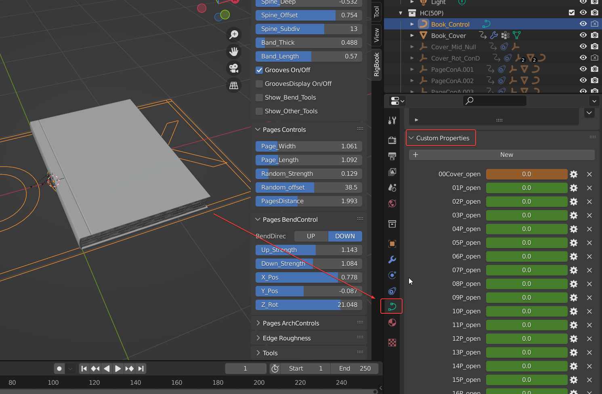
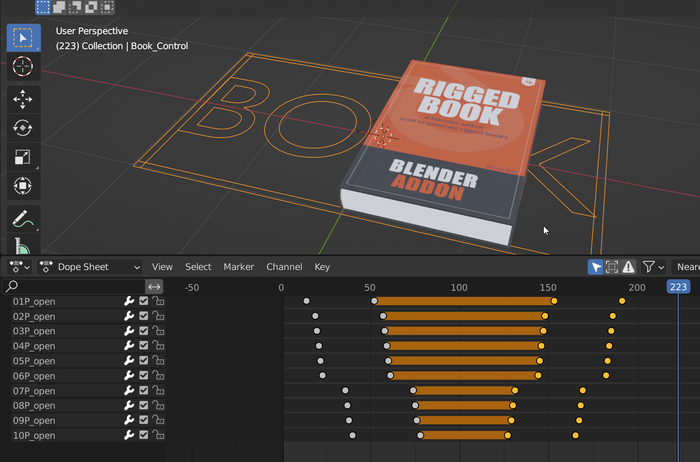

# 常见问题

---
###❓为什么只做了100页? 
可以做更多，但我觉得没必要，因为大部分时候CG制作只在乎书的厚度。

---

###❓适用EEVEE和Cycle吗? 
都适用。

---
###❓用到了几何节点吗？ 
没有，都是基础的约束和代码.

---
###❓我可以用别的渲染器吗？ 
可以，只要你会自己修改材质，这很简单，因为我没有设置复杂的材质系统。但是用了别的渲染器后，跟材质相关的边缘磨损效果参数就没有作用了。
	
###❓未来会有更多的更新吗？ 
我现在还有一些想法，但实现起来很困难，如果问题都解决了，我很乐意更新新的功能。当然如果现在的版本有bug，将来一定会尽力修复。
	
###❓怎么转换成纯模型？ 
选择控制器，点击最下面的convert to mesh 按钮。

###❓为什么第100页的动画控制器名称叫99p(100)？ 
因为命名为100P会让排序打乱。

###❓如何在封面添加立体字？ 
在书本闭合的情况下，找到大纲里书本集合下的Cover_Rot_ConD物体，在它下面又个Cover_Up_Null空物体，把文字作为它的子物体即可。你可以选择文字，按住shift键拖拽给Cover_Up_Null。

###❓如果不小心删除了关键帧怎么找回来? 
选择控制器，在控制器的自定义属性里，有所有参数，找到需要的参数给它打关键帧即可。

###❓如何制作书页合上的动画? 
如果要制作书页打开后又合上的动画，可以把后面的关键帧都删掉，把前面的关键帧mirror一下。

