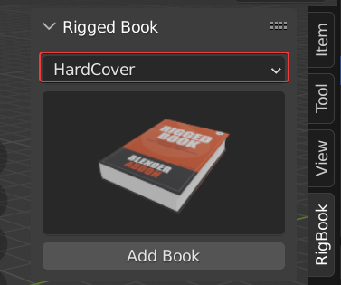
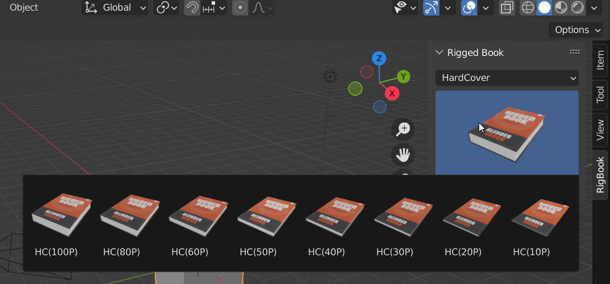
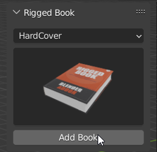
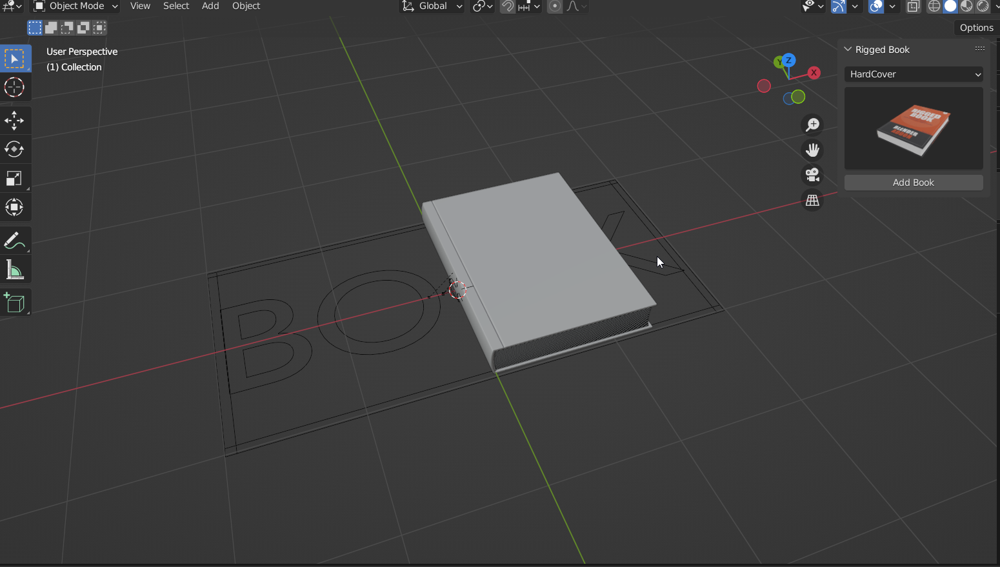
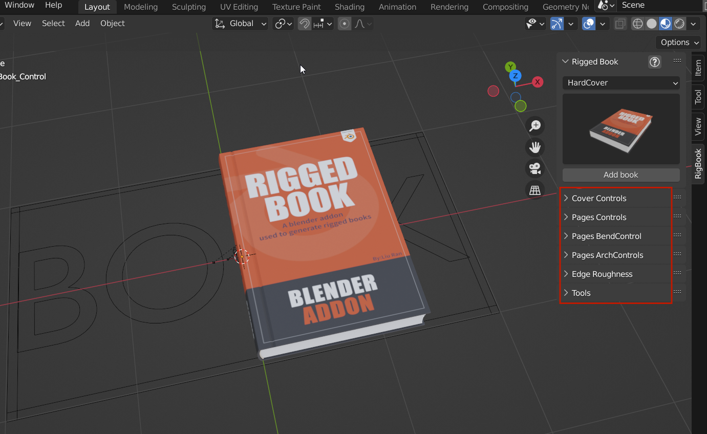

# 快速入门

打开N-panel面板，找到RigBook栏。  
先在目录中选择您要制作的书本类型，硬皮或软皮。

再点击书本的图片，再弹出的一排预置中选择您需要的页数（P代表页数）。  
!!! Note
    大部分情况下只需要确定书本大概的厚度，但如果需要的页数很精确，可以选择一个比您需要的页数多选项，在大纲里把多余的页模型隐藏。
		

选好后点击AddBook按钮即可在视图中添加一本书。  

选择写有Book标志的控制器,在右边就会出现很多控制栏，展开可以看到所有跟书本有关的控制参数。

此时播放，既可以看到书本翻看的动画了。

!!! Note
	您可以在 **[参数解释](parameters.md)** 页面具体了解所有参数的作用。在 **[动画调节](animations.md)** 页面了解书本翻页的动画设置。

